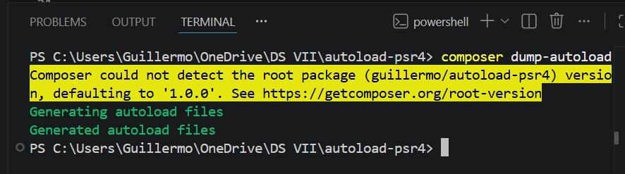
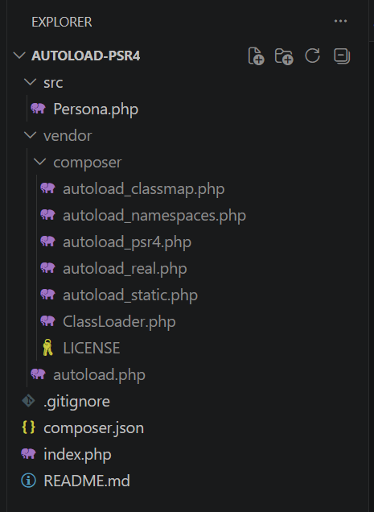

# Laboratorio PSR-4 con Composer

## Descripción
En este laboratorio se implementó la carga automática de clases en PHP utilizando Composer y el estándar PSR-4. La idea principal fue dejar de usar 'include' y 'require' manualmente y trabajar con namespaces y autoload para organizar mejor el proyecto.

## Requisitos
* PHP 8 o superior
* Composer
* Git

## Instrucciones de Instalación
1. Clonar el repositorio:
git clone https://github.com/siuki22/autoload-psr4.git

2. Abrir la carpeta del proyecto:
autoload-psr4

4. Generar mediante la terminar de visual studio code el autoload de Composer:
composer dump-autoload

6. Ejecutar el proyecto en la terminal de visual:
php index.php

## Estructura del proyecto
AUTOLOAD-PSR4/
- IMG/
  - dump-autoload.png
  - ejecucion.png
  - estructura.png
- src/
  - Persona.php
- vendor/
  - composer/
  - autoload.php
- .gitignore
- composer.json
- index.php
- README.md

## Configuración PSR-4
"autoload": {
    "psr-4": {
        "Guillermo\\AutoloadPsr4\\": "src/"
    }
}

## Prueba de funcionamiento
Comando ejecutado:
php index.php

Resultado obtenido:
Hola desde PSR-4

## Conclusiones Técnicas
### Mantenibilidad
Con PSR-4 es más fácil agregar nuevas clases al proyecto sin tener que modificar varios archivos manualmente.

### Eficiencia
Composer solo carga las clases cuando son necesarias, evitando cargar archivos innecesarios.

### Estandarización
El estándar PSR-4 ayuda a mantener una mejor organización del código y facilita el trabajo en equipo.

